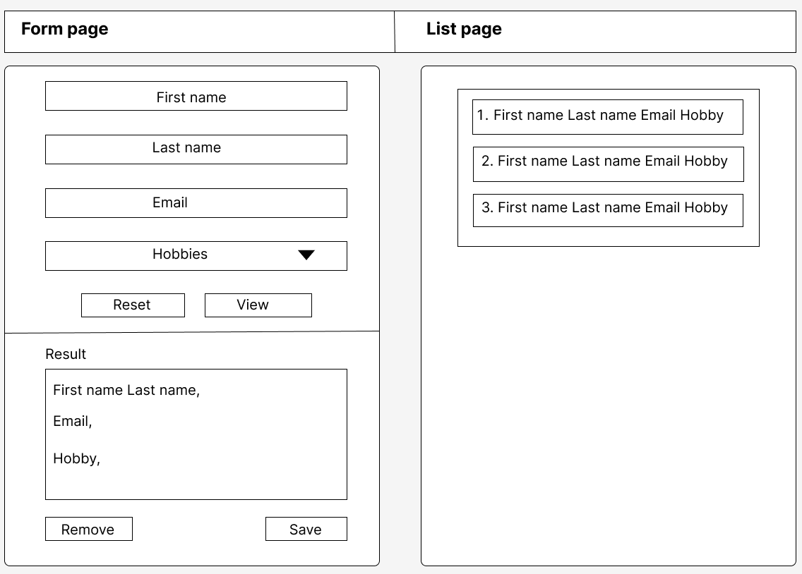

# TalentLyft Angular Interview a02

# Zadatak
Potrebno je kreirati Angular aplikaciju pomoću `Angular CLI-a` koja simulira svakodnevno korisničko ponašanje.

Aplikacija se treba sastojati od toolbar-a na vrhu ekrana koji ima dva linka za dvije rute.
Defaultno se prikazuje `Form page`.
Klikom na `Form page`, otvara se prva ruta, klikom na `List page` otvara se druga ruta.

### Na `Form page` ekranu se nalazi:
1) **Jednostavna forma za unos podataka**. Ona se sastoji od:
   - Unosa imena
   - Unosa prezimena
   - Unosa email-a
   - Unosa hobija (minimalno 3 hobija, recimo nogomet, košarka, rukomet)
   
   Klikom na button `Reset` treba resetira vrijednosti forme na inicijalnu vrijednost.
   Klikom na button `View` treba prikazati unesene vrijednosti forme u donjem dijelu prvog ekrana kao prikaz podataka.

2) **Jednostavni prikaz podataka**

    Potrebno je prikazati unesene podatke iz forme u proizvoljnom formatu i s proizvoljnim stilovima.
    Na `slici na vrhu` možete vidjeti primjer prikaza unesenih podataka.
    
    Klikom na button `Remove` podatci se uklanjaju iz prikaza.
    Klikom na button `Save`, trenutni podatci iz forme se spremaju u memoriju (trebat će nam za prikaz na drugom ekranu).

### Na `List page` ekranu se nalazi:
Lista do sada spremljenih podataka u proizvoljnom formatu i s proizvoljnim stilovima.

# Ostalo

Redoslijed rješavanja funkcionalnosti nije bitan. Dozvoljeno je koristiti se dokumentacijom za Angular (https://angular.io/) te bilo kojih drugih izvora. Za bilo kakva dodatna pitanja, potrebno je obratiti se na email s kojeg je zadatak poslan.

# Slanje rješenja

Rješenje zadatka poslati u .zip formatu (bez node_modules foldera) kao odgovor na email s kojeg je zadatak poslan.

Sretno sa rješavanjem! :)
